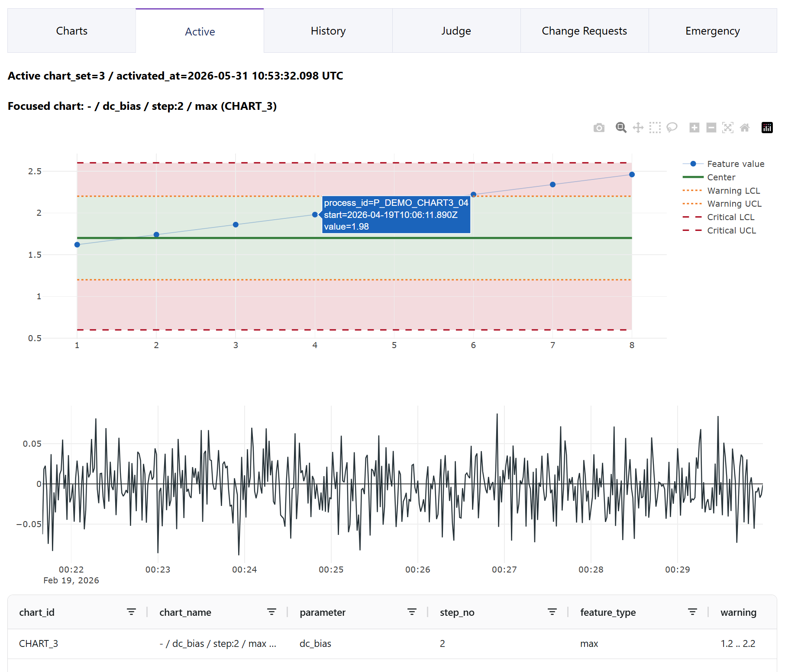
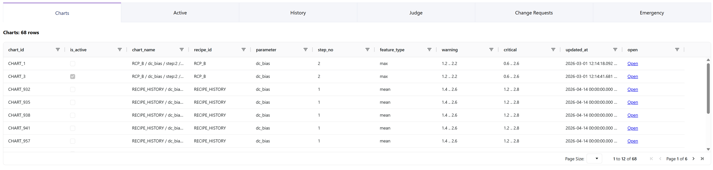

# FDC Logger Toolkit (Portfolio Edition)

[](https://github.com/mdht-daiki/fdc-logger-toolkit/actions/workflows/ci.yml)

製造装置ログを対象にした、ポートフォリオ向け FDC (Fault Detection & Classification) ツールキットです。

このプロジェクトは社内監視ツールを再構成した公開版で、機密情報や固有ロジックは削除し、以下に置き換えています。

- 疑似 logger データ生成機能
- 設定ファイルベースのマッピング/ルール
- ローカル SQLite パイプライン

## 採用担当向け 30秒サマリ

- 何を作ったか: 製造ログの取り込み・特徴量化・判定・可視化を、Python 単一リポジトリで再現できる FDC ミニ基盤
- どこを重視したか: モジュール境界（import-linter で強制）、SQLite 並行書き込み制御、しきい値変更の監査可能性
- すぐ確認できる点: `db_api` + `dashboard` + `main.run_once` の最短デモ導線、`pytest` と CI による回帰チェック

## 5分デモ導線（評価者向け）

1. `./tasks.ps1 install`（Windows）または `make install-dev`（Mac/Linux）
2. `./tasks.ps1 demo-db-api` で API 起動
3. 別ターミナルで `./tasks.ps1 demo-data`
4. 別ターミナルで `./tasks.ps1 demo-dashboard`
5. `http://localhost:8050` で SPC チャートとガバナンス UI を確認

## スクリーンショット

### SPC Active チャート画面



### ガバナンス 画面



---

## Portfolio Scope Snapshot

現在の公開版で「デモ可能」な範囲を明示します。

| Area      | Status  | Portfolio Scope                                                 |
| --------- | ------- | --------------------------------------------------------------- |
| db_api    | Ready   | SQLite gateway, governance endpoints, read/write API            |
| dashboard | Ready   | chart/judge/governance UI（change request / emergency / retry） |
| ingest    | Ready   | synthetic data -> scrape/aggregate -> DB 反映                   |
| judge     | Partial | `run_once` ベース。通知/MES 連携は段階対応中                    |
| ops docs  | Partial | runbook/rollback/checklist は継続整備中                         |

注記:

- `Ready` は「ポートフォリオのローカルデモ導線で再現できる範囲」を示します。
- `db_api` / `dashboard` の endpoint 詳細は `docs/db-api-endpoints.md` を参照してください。

---

## このプロジェクトで示していること

- 大規模 CSV ログ（1秒サンプリング）への対応
- 30分間隔の増分取り込み
- プロセス区間切り出し（edge-based / step-peak-based）
- ステップ単位特徴量（mean / max / min / std）抽出
- SPC 風しきい値監視（warn / crit）
- ダッシュボードでの可視化としきい値編集
- DB API 経由の SQLite 同時実行制御

---

## 構成コンポーネント

本リポジトリは主に 4 つのプログラムで構成されます。

1. **main**

- `scrape`: logger/device ログの増分読み取り
- `aggregate`: 区間切り出しと特徴量計算、DB への保存
- 主な保存先:
  - `ProcessInfo`（プロセス情報 + detail CSV パス）
  - `Parameters`（特徴量）
  - `StepWindows`（可視化用ステップ境界）
  - `ChartsV2`（ダッシュボードしきい値）

2. **dashboard**（Plotly Dash）

- 条件フィルタ（tool/chamber/recipe/parameter/step/feature-type）
- SPC チャート + しきい値表示
- 点クリックで生波形ドリルダウン（ステップ色分け）
- しきい値編集結果を DB に保存（ChartsV2）

3. **judge**

- 最新特徴量としきい値の取得
- warn/crit 判定
- アラート送信（メール）
- （公開版では stub）装置停止コマンド連携

4. **db_api**（FastAPI）

- SQLite 読み書きゲートウェイ（シリアライズ write queue）
- main/dashboard/judge 向け REST エンドポイント
- 読み取り中書き込み向け `Temp.db` スワップ戦略（任意）

---

## アーキテクチャ概要

```text
Synthetic Logger CSV / Equipment Logs
        |
      scrape  (incremental read)
        |
    aggregate (segmentation + features + detail csv)
        |
      db_api   (SQLite gateway)
     /   |   \
dashboard judge  (future: exporter)
```

---

## データフロー（概要）

- Logger raw CSV:
  - 1秒サンプリングの大容量ストリーム
  - `timestamp,value01,value02,...` 形式
  - 異常注入用の内部マスクを使う場合があるが CSV には出力しない
  - ヘッダー部と `DATA` マーカー行を含む

- scrape:
  - 前回実行以降の新規行のみ抽出（約30分）
  - 巨大 CSV 全体は読まず、必要に応じて末尾読み取り
  - `tool_id` / `chamber_id` 付与
  - マッピングファイルでチャンネル名を論理名へ変換

- aggregate:
  - プロセス区間切り出し
    - edge-based: キーチャンネルの ON 区間検出
    - step-peak-based: 複数ステップを 1 プロセスとして束ねる
  - ダッシュボード用 detail 波形を長形式 CSV で保存
  - `ProcessInfo` / `Parameters` / `StepWindows` を書き込み

---

## segmentation モジュール概要

`src/portfolio_fdc/core/segmentation` には、区間切り出しと特徴抽出に必要な中核ロジックがあります。

- `peak_detector.py`: チャネルごとのピーク区間検出
- `aligner.py`: `dc_bias` を基準に複数チャネルのピークを整列
- `queue.py`: 最新ステップ束の固定長キュー管理
- `classifier.py`: ルールベースで recipe 判定
- `splitter.py`: 3ステップを4ステップへ再分割する補助
- `features.py`: ステップ区間ごとの統計特徴量抽出
- `models.py`: `StepPeak` / `StepBundle` / `ProcessSegment` などのデータモデル

---

## 設定ファイルスキーマ（概要）

- `src/portfolio_fdc/configs/aggregate_tools.yaml`
  - `tools.<tool_id>.channels`（生ログチャネル名→論理名の対応）
  - `tools.<tool_id>.chamber_id`（装置チャンバー識別子）
- `src/portfolio_fdc/configs/recipe_rules.yaml`
  - `recipes.<recipe_id>.steps[]`（各ステップの判定レンジ定義）
  - 例: `dc_bias_mean`, `cl2_flow_mean` の許容レンジ
- `src/portfolio_fdc/configs/sensor_map.csv`
  - 必須列: `tool_id`, `sensor`, `parameter`
  - 役割: ツール別にセンサ名を論理パラメータ名へマッピング
- `src/portfolio_fdc/configs/segmentation.yaml`
  - `channels.*`: チャネルごとのしきい値定義（ピーク検出に利用）
  - `post_process.merge_gap_sec`: 近接区間マージのギャップ秒数
  - `peak_detector.py` との関係: `channels.*` のしきい値でピーク候補を検出し、`post_process.merge_gap_sec` を使ってギャップ結合を調整

---

## DBスキーマ（概要）

主要テーブルの役割は以下です。

- `ProcessInfo`: プロセス単位メタ情報（開始/終了時刻、detail CSVパス）
- `StepWindows`: ステップ境界情報（`process_id`, `step_no`, `start_ts`, `end_ts`）
- `Parameters`: 特徴量（`parameter`, `feature_type`, `feature_value`）
- `Charts` / `ChartsV2`: 監視しきい値定義
- `JudgementResults`: 判定結果履歴
- `ChartSet` / `ActiveChartSet` / `ChartsHistory`: しきい値セット管理と変更履歴

---

## セットアップ

**前提: SQLite >= 3.38**

`db_api` の `chart_repository.py` は `datetime(h.changed_at)` 比較を使用しており、ISO 8601 のパース動作が
SQLite 3.38（2022-02-22 リリース）で安定化されています。
`_normalize_query_datetime`（`db_api/app.py`）がクエリ日時を UTC ISO 8601 に正規化してから
この比較に渡しますが、SQLite < 3.38 では期間フィルタが誤動作する可能性があります。
Python 3.11 に同梱される SQLite は通常 3.39 以上ですが、自前でビルドした環境では
`python -c "import sqlite3; print(sqlite3.sqlite_version)"` で確認してください。

```bash
python -m venv .venv
source .venv/bin/activate
pip install -U pip
pip install -e ".[dev]"
pre-commit install
```

```powershell
python -m venv .venv
.\.venv\Scripts\Activate.ps1
python -m pip install -U pip
python -m pip install -e ".[dev]"
pre-commit install
```

---

## クイックスタート（ローカル）

### 0) 最短デモ（3ステップ）

`db_api` を起動した状態で、次の 3 ステップで dashboard まで確認できます。

1. サンプルデータ生成 + 1サイクル投入

```powershell
.\tasks.ps1 demo-data
```

```bash
make demo-data
```

2. dashboard 起動

```powershell
.\tasks.ps1 demo-dashboard
```

```bash
make demo-dashboard
```

3. ブラウザで確認

- `http://localhost:8050` を開く
- Change Requests / Emergency タブでフォーム入力から payload preview を確認
- 初見向けの操作手順は `docs/dashboard-user-guide.md` を参照

`db_api` をまだ起動していない場合:

```powershell
.\tasks.ps1 demo-db-api
```

```bash
make demo-db-api
```

トラブル時の最小復旧:

1. `PORTFOLIO_DB_DIR` が不整合なら unset して再起動
2. `data/db/main.db` をバックアップ退避後に再生成
3. `.\tasks.ps1 install`（または `make install-dev`）を再実行

---

### 1) db_api を起動

```bash
python -m portfolio_fdc.db_api.app
# or uvicorn portfolio_fdc.db_api.app:app --host 0.0.0.0 --port 8000
```

DB 保存先を変更したい場合は、環境変数 `PORTFOLIO_DB_DIR` を指定できます。
この環境変数はアプリ起動時に読み込まれるため、必ず `python -m portfolio_fdc.db_api.app` を実行する前に設定してください。

```bash
export PORTFOLIO_DB_DIR=/path/to/data/db
python -m portfolio_fdc.db_api.app
```

```powershell
$env:PORTFOLIO_DB_DIR = "E:/work/python/logger/data/db"
python -m portfolio_fdc.db_api.app
```

現時点の実装スコープ（ポートフォリオデモ）:

- `aggregate` 連携 endpoint
  - `POST /aggregate/write`（推奨）
  - `POST /processes`
  - `DELETE /processes/{process_id}`（推奨）
  - `DELETE /processes`（互換）
  - `POST /step_windows/bulk`
  - `POST /parameters/bulk`
- dashboard/judge/governance の read/write endpoint（change request / emergency / retry を含む）
- 主要 endpoint 一覧と consumer 範囲は `docs/db-api-endpoints.md` を正本として参照

### 2) 疑似 logger CSV を生成

```bash
python -m portfolio_fdc.tools.generate_logger_csv --out data/raw/logger_raw.csv --seconds 86400 --scenario mix
```

### 3) main パイプラインを実行（scrape + aggregate）

```bash
python -m portfolio_fdc.main.run_once --tool TOOL_A --raw data/raw/logger_raw.csv --db-api http://localhost:8000
```

レシピルールファイルのパスを変更したい場合は、環境変数 `PORTFOLIO_RECIPE_RULES_PATH` を指定できます。
この環境変数はアプリ起動時に読み込まれるため、必ず `python -m portfolio_fdc.main.aggregate` を実行する前に設定してください。

```bash
export PORTFOLIO_RECIPE_RULES_PATH=/path/to/recipe_rules.yaml
```

```powershell
$env:PORTFOLIO_RECIPE_RULES_PATH = "E:/work/python/logger/src/portfolio_fdc/configs/recipe_rules.yaml"
```

DB API 未起動時は `aggregate` の dry-run（ローカル処理のみ、POST なし）も可能です。

```bash
python -m portfolio_fdc.main.aggregate \
  --input data/scrape/scrape_TOOL_A.csv \
  --config src/portfolio_fdc/configs/aggregate_tools.yaml \
  --detail-out data/detail \
  --dry-run
```

Makefile 版（Mac/Linux）:

```bash
make aggregate-dry-run
# optional override
make aggregate-dry-run AGG_INPUT=data/scrape/scrape_TOOL_B.csv AGG_DETAIL_OUT=data/detail_tmp
```

PowerShell タスク版（Windows）:

```powershell
.\tasks.ps1 aggregate-dry-run
# optional override
.\tasks.ps1 aggregate-dry-run -AggInput data/scrape/scrape_TOOL_B.csv -AggDetailOut data/detail_tmp
```

### 4) dashboard を起動

```bash
python -m portfolio_fdc.dashboard.app
# open http://localhost:8050
```

### 5) judge を手動実行

```bash
python -m portfolio_fdc.judge.run_once --db-api http://localhost:8000
```

---

## 開発コマンド

```bash
make fmt
make lint
make type
make test
make all
```

---

## CI 品質ゲート

Pull Request では以下の通過が必要です。

- Ruff（lint + format check）
- MyPy（`src` 型チェック）
- Import Linter（モジュール境界）
- Pytest（回帰）
- （任意）CodeRabbit review

CI 定義: `.github/workflows/ci.yml`

---

## 免責

本リポジトリはポートフォリオ向け簡易版です。
本番向けの機密ロジック、固有プロセス条件、社内インフラ詳細は含みません。
