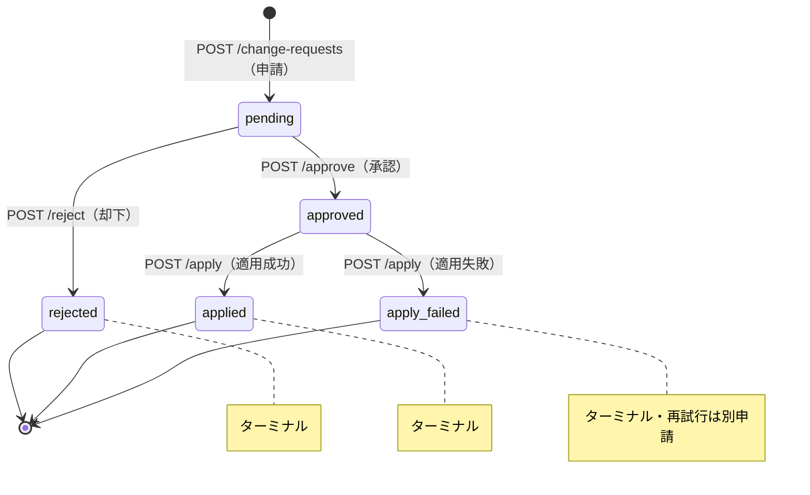

# Decision Log

## 2026-05-04: `#140` governance schema 基盤 - 論点1〜8 GovernanceAuditEvents / GovernanceNotificationOutbox 確定

日付基準: JST

### Context

Discussion #183 で audit events と notification outbox の最小契約を確定する必要があった。
前 PR（chore/governance-schema-documentation）で論点1〜9（GovernanceChangeRequests 〜 保管期間）は確定済みであり、
本エントリはその後続として audit / outbox 層を固定する。

### Decision

#### 論点1: GovernanceAuditEvents 最小列定義

```sql
CREATE TABLE IF NOT EXISTS GovernanceAuditEvents (
    id             INTEGER PRIMARY KEY AUTOINCREMENT,
    event_type     TEXT    NOT NULL,
    actor          TEXT    NOT NULL,
    actor_role     TEXT    NOT NULL,
    target_type    TEXT    NOT NULL,   -- 'change_request' | 'emergency_change' | 'notification'
    target_id      INTEGER NOT NULL,   -- 対応テーブルの id
    occurred_at    TEXT    NOT NULL,
    before_json    TEXT,               -- 変更前 snapshot（変更系のみ）
    after_json     TEXT,               -- 変更後 snapshot（変更系のみ）
    correlation_id TEXT               -- 同一フロー内イベントを束ねる任意ID（NULL可）
);
CREATE INDEX IF NOT EXISTS idx_audit_events_type_time
    ON GovernanceAuditEvents(event_type, occurred_at);
CREATE INDEX IF NOT EXISTS idx_audit_events_target
    ON GovernanceAuditEvents(target_type, target_id);
```

- `source` 列は `event_type` から自明なため不要
- `correlation_id` は NULL 許可。将来のトレース用に列として確保

#### 論点2: event_type 一覧（Phase 1 確定）

| event_type                     | 発生タイミング        | before/after                         |
| ------------------------------ | --------------------- | ------------------------------------ |
| `change_requested`             | change_request 作成時 | after のみ（申請内容）               |
| `change_request_approved`      | approve 完了時        | なし                                 |
| `change_request_rejected`      | reject 時             | なし                                 |
| `change_request_applied`       | apply 成功時          | 閾値の before/after（フル snapshot） |
| `change_request_apply_failed`  | apply 失敗時          | after に error_code/message          |
| `emergency_changed`            | 緊急変更完了時        | 閾値の before/after（フル snapshot） |
| `emergency_ratified`           | 追認完了時            | なし                                 |
| `notification_queued`          | outbox INSERT 時      | なし                                 |
| `notification_sent`            | 送信成功時            | なし                                 |
| `notification_retry_succeeded` | retry 成功時          | なし                                 |
| `notification_retry_failed`    | retry 上限到達時      | なし                                 |

Phase 2 以降候補: `notification_dead_lettered`

#### 論点3: before/after の差分形式

| event_type               | before_json                 | after_json                  |
| ------------------------ | --------------------------- | --------------------------- |
| `change_request_applied` | 変更前全フィールド snapshot | 変更後全フィールド snapshot |
| `emergency_changed`      | 変更前全フィールド snapshot | 変更後全フィールド snapshot |
| `change_requested`       | null                        | 申請内容（delta のみで可）  |
| それ以外                 | null                        | null                        |

- changed fields のみでは before が何だったか復元できないため、apply と緊急変更は必ず全フィールド snapshot
- no-op 更新（値に差分なし）の場合: audit event も ChartsHistory も残さない（`#109` 決定済み）

#### 論点4: audit writer の責務境界

- **service 層からの明示呼び出し**に統一
- repository 内部に audit writer を埋め込まない（repository は単一テーブルの CRUD 責務に限定）
- `AuditEventWriter.write(con, event_type, actor, actor_role, target_type, target_id, occurred_at, before_json=None, after_json=None, correlation_id=None)` の 1 メソッドのみ
- `occurred_at` の正規化（`datetime_util.to_utc_millis()`）は呼び出し側（service 層）の責務。writer 内では正規化しない

#### 論点5: GovernanceNotificationOutbox 最小列定義

```sql
CREATE TABLE IF NOT EXISTS GovernanceNotificationOutbox (
    id              INTEGER PRIMARY KEY AUTOINCREMENT,
    event_id        INTEGER NOT NULL,    -- GovernanceAuditEvents.id（emergency_changed イベントが起点）
  status          TEXT    NOT NULL DEFAULT 'pending' CHECK (status IN ('pending','sent','failed')),
    retry_count     INTEGER NOT NULL DEFAULT 0,
    next_retry_at   TEXT,               -- NULL = 即時試行可
    last_attempt_at TEXT,
    last_error      TEXT,
    delivered_at    TEXT,               -- 成功時のみ設定
    FOREIGN KEY (event_id) REFERENCES GovernanceAuditEvents (id)
);
CREATE INDEX IF NOT EXISTS idx_notification_outbox_status
    ON GovernanceNotificationOutbox(status, next_retry_at);
```

FK の方向:

- `outbox.event_id → GovernanceAuditEvents.id`（起点 audit event への参照）
- retry 系 audit event（`notification_queued` / `notification_retry_failed` 等）は `target_type='notification', target_id=outbox.id` で論理参照。循環 FK を避ける

#### 論点6: notification status モデル

`sending` を省略した真の3状態を採用する。

```text
pending → sent（ターミナル）
        ↘ failed
failed → sent（retry 成功、ターミナル）
       → failed（retry 上限到達、ターミナル）
```

- SQLite ローカル・単一 FastAPI プロセス・明示 retry 呼び出し方式のため並行送信シナリオがない
- `sending` を持つと「クラッシュで永続 sending」スタック問題が生じ回収ロジックが必要になる
- 二重送信防止は `UPDATE SET status='sent' WHERE status IN ('pending','failed') AND retry_count < 3` をトランザクション内で実行することで担保

#### 論点7: retry の契約

| 項目                                           | 方針                                                                     |
| ---------------------------------------------- | ------------------------------------------------------------------------ |
| retry 対象                                     | `status = 'failed'` のみ                                                 |
| retry_count 上限                               | 3 回（`#102` write 系 attempts 上限に統一）                              |
| next_retry_at 算出                             | 指数バックオフ（1分, 5分, 30分）。`datetime_util.to_utc_millis()` で記録 |
| 上限到達後                                     | `status = 'failed'` のまま `next_retry_at = NULL` で取得対象から外れる   |
| 最終失敗の監査連携                             | 上限到達時に `notification_retry_failed` audit event を INSERT           |
| retry API に `sent` / `pending` を指定した場合 | 400（retry 対象外）                                                      |

retry は `POST /governance/notifications/{event_id}/retry` の明示呼び出し方式（バックグラウンドポーリングは今回対象外）。

#### 論点8: apply 時にも outbox を使うか

Phase 1 は**緊急変更通知のみ** outbox 対象とする。
通常 apply（承認フロー経由）は UI または ops が確認しているため追加通知は不要。
将来的に通常 apply 通知が必要になった場合は `target_type` を使って自然に拡張できる設計になっている。

### Why

- `source` 列省略: `event_type` から一意に判断できるため過剰
- `sending` 状態省略: ローカル SQLite 単一プロセスでは並行送信が起きないため、スタック状態を作るリスクの方が大きい
- FK 方向（outbox → audit）: audit event を起点とする参照方向が自然。循環参照を避け、retry 系イベントは論理参照で対応
- audit writer を service 層に置く: repository が別テーブルを書く責務を持つと境界が曖昧になる。service 層の 1 TX ブロック内で writer を呼ぶことで同一 transaction を保証できる

### Consequence

- `GovernanceAuditEvents` と `GovernanceNotificationOutbox` の CREATE TABLE を `db_api/db.py` の初期化処理に追加
- `AuditEventWriter` クラスを `db_api/` 配下に新規作成（実装 PR 別途）
- `#144`（GET audit-events / POST notifications retry）の endpoint 契約はこのスキーマを前提に定義

## 2026-05-03: `#140` governance schema 基盤 - version 正本、chart_name追加、API配置方針の確定

日付基準: JST

### Context

`#140` でガバナンス用テーブル（change_requests, approvals, apply_results, emergency_changes, ratifications, audit_events, notification_outbox）
の実装を開始するにあたり、以下の 3 つの設計判断が必要だった：

1. ChartsV2.version を動的算出（ChartsHistory 件数から）するか、永続列として保存するか
2. chart_name を ChartsV2 に追加するかどうか
3. governance endpoint を db_api 内に同居させるか、独立サービスで分離するか

既存実装では version が ChartsHistory の COUNT + 1 で動的算出されていたが、#109 で確定した
expected_version 楽観ロック（`UPDATE WHERE version=?`）を効率的に実装するには、
version 正本の方針を先に固定する必要があった。

### Decision

以下の 3 つの方針を採用する。

#### 1. Version 正本は ChartsV2 永続列（方式 B）

- ChartsV2 に `version INTEGER NOT NULL DEFAULT 1` を migration で追加
- 既存行は全て DEFAULT 1 にセット
- `UPDATE ChartsV2 SET ..., version = version + 1 WHERE id = ? AND version = ?` で原子的競合制御
- `GET /charts` の version 取得を履歴算出から列参照に切替
- ChartsHistory は監査履歴の正本であり、version 計算には使わない

#### 2. chart_name 列を ChartsV2 に追加

- `chart_name TEXT` として追加（NULL 可）
- dashboard は既に `build_chart_name()` で composite フォールバック実装済みのため、既存表示は壊れない
- change_payload の対象に chart_name を含める（閾値フィールドと同等に扱う）
- charts_seed.yaml への chart_name キー追加は別 PR（通常変更フロー対象）

#### 3. Governance API は当面 db_api 内に同居

- 同一トランザクション保証（chart 更新、履歴記録、監査イベント、outbox 登録を 1 transaction）が実装上必須
- SQLite の排他制御と既存設計方針に整合
- 分離は「同一トランザクション保証が困難になった」または「認可・スケール要件が明確に求められた」時点で再評価

### Why

#### version 正本を永続列にした理由

- expected_version 楽観ロック（`UPDATE WHERE version=?`）に最短で自然接続できる
- 競合判定ロジックが単純で、テストが明確に書ける
- 更新件数を直接判定できるため、apply/retry 制御が堅牢になる
- 既存の動的算出方式は、履歴件数が増えるほど read/write パフォーマンスに影響

#### chart_name 追加の理由

- dashboard 実装では既に column が期待されている
- 既存フォールバック機構で互換性が保たれるため、段階的導入が可能
- governance change_payload の対象として自然

#### governance API を同居させた理由

- SQL transaction で申請・承認・適用・監査が 1 atomic unit になる
- 分散トランザクション問題を避けられる
- SQLite の wal_mode 環境下での並行性を最大化できる

### Consequence

- #140 migration スクリプトは `ChartsV2.version` と `ChartsV2.chart_name` の `_add_column_if_missing` パターン追加
- `chart_repository.find_charts()` の SQL は ChartsHistory から version を計算しない（列参照のみ）
- governance apply 実装は `UPDATE ChartsV2 SET version=version+1 WHERE id=? AND version=?` をコア構文に
- `docs/architecture.md` に governance API 分離の将来可能性を明記（既実施）
- `docs/db-api-endpoints.md` の governance endpoint は db_api 配下に配置として追跡継続

## 2026-05-03: #140 governance schema 基盤 - 論点3 GovernanceApplyResults 最小列定義

日付基準: JST

### Context

GovernanceChangeRequests（申請）→ GovernanceApprovals（承認）の次のステップとして、
実際に chart への変更を適用した結果を記録するテーブルの定義が必要だった。
Phase 1 では申請 1 件に対して適用試行も 1 回とし、失敗時の再試行は別申請として扱う方針を前提とした。

### Decision

```sql
CREATE TABLE IF NOT EXISTS GovernanceApplyResults (
    id                INTEGER PRIMARY KEY AUTOINCREMENT,
    request_id        INTEGER NOT NULL UNIQUE,
    applied_at        TEXT    NOT NULL,
    success           INTEGER NOT NULL CHECK (success IN (0, 1)),
    resulting_version INTEGER,
    error_code        TEXT,
    error_message     TEXT,
    FOREIGN KEY (request_id) REFERENCES GovernanceChangeRequests (id)
);
```

| 列                  | 型                          | 理由                                                                     |
| ------------------- | --------------------------- | ------------------------------------------------------------------------ |
| `request_id` UNIQUE | FK→GovernanceChangeRequests | 1申請 = 1適用結果（Phase 1）。再試行は別申請                             |
| `applied_at`        | TEXT NOT NULL               | UTC ISO 8601 ミリ秒固定（to_utc_millis 利用）                            |
| `success`           | INTEGER 0/1                 | 成功/失敗の二値。SQLite に BOOLEAN 型は存在しないため整数                |
| `resulting_version` | INTEGER NULL                | 成功時のみ記録（= expected_version + 1）。失敗時は NULL                  |
| `error_code`        | TEXT NULL                   | 失敗時の分類コード（例: `STALE_VERSION`, `FK_VIOLATION`）。成功時は NULL |
| `error_message`     | TEXT NULL                   | 失敗時の詳細（例外メッセージ）。成功時は NULL                            |

### Why

- `request_id UNIQUE` によって「1申請 = 1適用」の不変条件をスキーマで強制する
- `resulting_version` は apply TX 内で `SELECT version` して INSERT 直前に取得し、楽観ロック成功後の版数を確定値として残す
- `success=0` のレコードを残すことで失敗履歴を監査可能にする（delete/update 不可）
- `error_code` を構造化することで監視アラートや分類集計に使える

### Consequence

- apply 失敗時は GovernanceChangeRequests.status を `apply_failed` に更新し、申請者が新規申請を起票する（再試行不可）
- apply TX スコープ（論点 8 で確定予定）: ChartsV2 UPDATE + ChartsHistory INSERT + GovernanceApplyResults INSERT + GovernanceChangeRequests status UPDATE + GovernanceAuditEvents INSERT = 1 transaction
- `resulting_version` の整合チェック（= ChartsV2.version after apply）は integration テストの受け入れ条件に含める

## 2026-05-03: #140 governance schema 基盤 - 論点4 GovernanceEmergencyChanges 最小列定義

日付基準: JST

### Context

通常フロー（申請→承認→適用）ではなく、障害対応など緊急時に即時 chart 変更を行うケースへの対応テーブルが必要だった。
GovernanceChangeRequests との差分として、事前承認がない分、記録の厳密性（reason 必須、フルスナップショット）と事後追認（GovernanceRatifications）を要件とした。

### Decision

```sql
CREATE TABLE IF NOT EXISTS GovernanceEmergencyChanges (
    id                  INTEGER PRIMARY KEY AUTOINCREMENT,
    chart_id            INTEGER NOT NULL,
    changed_by          TEXT    NOT NULL,
    changed_by_role     TEXT    NOT NULL,
    changed_at          TEXT    NOT NULL,
    reason              TEXT    NOT NULL,
    before_json         TEXT    NOT NULL,
    after_json          TEXT    NOT NULL,
    resulting_version   INTEGER NOT NULL,
    related_issue_or_pr TEXT,
    FOREIGN KEY (chart_id) REFERENCES ChartsV2 (id)
);
```

| 列                    | 型                | 理由                                                            |
| --------------------- | ----------------- | --------------------------------------------------------------- |
| `changed_by`          | TEXT NOT NULL     | 緊急変更実行者の識別子                                          |
| `changed_by_role`     | TEXT NOT NULL     | ロール記録（ratification 要件判定に使用）                       |
| `reason`              | TEXT **NOT NULL** | 緊急変更には理由必須。監査に耐えるための強制                    |
| `before_json`         | TEXT NOT NULL     | フルスナップショット（差分ではなく全フィールド）                |
| `after_json`          | TEXT NOT NULL     | 同上                                                            |
| `resulting_version`   | INTEGER NOT NULL  | 変更後の ChartsV2.version。失敗は TX ロールバックのため記録なし |
| `related_issue_or_pr` | TEXT NULL         | 事後 ratification の紐付け先（後から埋めても可）                |

### Why

- `reason NOT NULL` は GovernanceChangeRequests との最大の差分。緊急変更は事前審査がない分、「なぜ緊急変更が必要だったか」の記録を強制する
- `before_json` / `after_json` はフルスナップショットにする。差分（delta）では緊急変更前後の状態を単独で再現できない
- 失敗ケースはレコードを残さない（TX ロールバック）。GovernanceApplyResults との違いはここにある
- `expected_version` は不要（緊急時に事前バージョン確認を強制しない）。ただし apply TX で version+1 は行う

### Consequence

- 緊急変更 TX スコープ（論点 8 で確定予定）: ChartsV2 UPDATE + ChartsHistory INSERT + GovernanceEmergencyChanges INSERT + GovernanceAuditEvents INSERT + GovernanceNotificationOutbox INSERT = 1 transaction
- 事後追認は GovernanceRatifications（論点 5）で管理
- `related_issue_or_pr` は apply 直後は NULL でよく、ratification 完了後に UPDATE で埋める運用を想定

## 2026-05-04: #140 governance schema 基盤 - 論点5 GovernanceRatifications 最小列定義

日付基準: JST

### Context

GovernanceEmergencyChanges（緊急変更）は事前承認なしで即時適用されるため、事後追認フローが必要だった。
GovernanceApprovals（事前承認）との対称性を保ちつつ、1緊急変更 = 1追認の不変条件をスキーマで強制する。

### Decision

```sql
CREATE TABLE IF NOT EXISTS GovernanceRatifications (
    id                   INTEGER PRIMARY KEY AUTOINCREMENT,
    ec_id                INTEGER NOT NULL UNIQUE,
    ratified_by_role     TEXT    NOT NULL,
    ratified_at          TEXT    NOT NULL,
    ratification_comment TEXT,
    related_pr           TEXT,
    FOREIGN KEY (ec_id) REFERENCES GovernanceEmergencyChanges (id)
);
```

| 列                     | 型                            | 理由                                                                                     |
| ---------------------- | ----------------------------- | ---------------------------------------------------------------------------------------- |
| `ec_id` UNIQUE         | FK→GovernanceEmergencyChanges | 1緊急変更 = 1追認。重複追認は UNIQUE 制約でブロック → HTTP 409                           |
| `ratified_by_role`     | TEXT NOT NULL                 | 追認者ロール（監査要件上必須）                                                           |
| `ratified_at`          | TEXT NOT NULL                 | UTC ISO 8601 ミリ秒固定（to_utc_millis 利用）                                            |
| `ratification_comment` | TEXT NULL                     | 追認理由・補足。NULL 可（role 記録があれば最低限の監査は成立）                           |
| `related_pr`           | TEXT NULL                     | 計画段階で紐付ける予定 PR/Issue。確定実績は emergency_changes.related_issue_or_pr に記録 |

### Why

- `ec_id UNIQUE` によって「1緊急変更 = 1追認」をスキーマで強制し、二重追認を防ぐ
- GovernanceApprovals との構造的対称性を保つことで実装パターンが共通化できる
- `related_pr` と `emergency_changes.related_issue_or_pr` の二重管理は意図的: 前者は計画段階の紐付け、後者は追認完了時点の確定 PR/Issue を記録する

### Consequence

- 重複追認は HTTP 409 を返す（GovernanceApprovals の重複承認と同じ扱い）
- `related_pr` は追認時点で NULL でよく、計画段階で紐付け済みならその値を保持する
- 確定した PR/Issue は追認完了後に `GovernanceEmergencyChanges.related_issue_or_pr` を UPDATE で埋める運用を想定
- 追認期限（24h 以内 or 翌営業日内）の強制はアプリケーション層の責務とし、スキーマでは強制しない

## 2026-05-04: #140 governance schema 基盤 - 論点6 GovernanceChangeRequests 状態遷移モデル

日付基準: JST

### Context

GovernanceChangeRequests の `status` 列に格納する値と遷移ルールを明確にする必要があった。
ターミナル状態の不変条件と、各操作の HTTP ステータスコード方針もあわせて確定する。

### Decision

#### status 値と遷移



| status         | 意味                   | 遷移先                             |
| -------------- | ---------------------- | ---------------------------------- |
| `pending`      | 申請受付済み、承認待ち | `approved` / `rejected`            |
| `approved`     | 承認済み、apply 待ち   | `applied` / `apply_failed`         |
| `applied`      | 適用完了               | なし（ターミナル）                 |
| `apply_failed` | 適用失敗               | なし（ターミナル）。再試行は別申請 |
| `rejected`     | 却下済み               | なし（ターミナル）                 |

#### HTTP ステータスコード方針

`POST /apply` handler は、まず `expected_version` 一致を確認し、通過後に status を分岐する。status 分岐では `applied` / `apply_failed` を先に 409 とし、それ以外の `approved` 以外（`pending` / `rejected`）を 400 とする。

| 操作          | 条件                                                | HTTP |
| ------------- | --------------------------------------------------- | ---- |
| POST /approve | status が `pending` 以外                            | 409  |
| POST /apply   | expected_version 不一致（楽観ロック失敗）           | 409  |
| POST /apply   | 既に `applied` / `apply_failed`                     | 409  |
| POST /apply   | status が `approved` 以外（`pending` / `rejected`） | 400  |
| POST /ratify  | ec_id の ratification レコードが既存                | 409  |

### Why

- ターミナル状態（`applied` / `rejected` / `apply_failed`）を明示することで、「なぜ再試行できないか」をスキーマ設計レベルで表明できる
- `apply_failed` を `rejected` と分けることで、「申請は正当だったが apply 時にエラーが発生した」と「審査で却下された」を区別し、障害追跡に活用できる
- HTTP 409 を状態不整合（競合）、400 を前提条件違反（apply を approved でない申請に行う等）で使い分ける

### Consequence

- ターミナル状態に遷移したレコードへの status UPDATE はアプリケーション層で防止（DB 制約では強制しない）
- `GovernanceChangeRequests` テーブルに `CHECK (status IN ('pending','approved','applied','apply_failed','rejected'))` を追加することで、スキーマレベルの保護も可能（Phase 2 以降の検討事項）
- 状態遷移テストは「無効な遷移が 409 を返すこと」を受け入れ条件に含める

## 2026-05-04: #140 governance schema 基盤 - 論点7 キーと制約の方針

日付基準: JST

### Context

全 governance テーブルの PK 型、FK ON DELETE 挙動、UNIQUE 制約、論理削除方針を統一する必要があった。
また、Chart の「削除」ユースケースについて、FK RESTRICT 方針との整合性を確認した。

### Decision

#### PK・FK・論理削除

| 項目         | 方針                                                                                        |
| ------------ | ------------------------------------------------------------------------------------------- |
| PK 型        | 全テーブル `INTEGER PRIMARY KEY AUTOINCREMENT`（既存テーブルと統一）                        |
| FK ON DELETE | `RESTRICT`（デフォルト）。監査レコードは削除不可、親削除試みは FK エラーで防止              |
| 論理削除     | 不使用。ターミナル status（`rejected` / `apply_failed`）で代替。DELETE 自体をアプリ層で禁止 |

#### UNIQUE 制約一覧

| テーブル                 | 列                                | 意図                                 |
| ------------------------ | --------------------------------- | ------------------------------------ |
| GovernanceApprovals      | `request_id`                      | 1申請 = 1承認                        |
| GovernanceApplyResults   | `request_id`                      | 1申請 = 1適用結果                    |
| GovernanceRatifications  | `ec_id`                           | 1緊急変更 = 1追認                    |
| GovernanceChangeRequests | `idempotency_key`（インデックス） | クライアント再送時の重複 INSERT 防止 |

#### Chart の「削除」ユースケース

- **非活性化（推奨）**: `ActiveChartSet` からレコードを削除し ChartsV2 は保持。監査履歴が保全される
  - change_payload に `"deactivate": true` を含む change_request を通常フローで起票
- **物理削除（例外）**: 誤登録チャートの完全消去など。governance レコードが存在する限り FK エラーになるため DB 直接操作が必要
  - 監査証跡が失われるため非推奨。必要な場合は runbook（`docs/chart-governance-playbook.md`）に手順を記載
- **保管期間による削除**: 容量管理目的の一括削除は論点 9（削除・アーカイブ・保管期間）で別途確定する

### Why

- `ON DELETE RESTRICT` で監査証跡の孤立/消失を防ぐ
- スキーマ UNIQUE 制約によって「1申請 = 1処理結果」の不変条件を DB レベルで強制する
- 削除を「非活性化」として扱うことで、FK 制約と監査要件を両立させる

### Consequence

- Phase 1 の DELETE 操作はアプリ層で原則禁止（governance テーブル全体）
- 保管期間による削除方針は論点 9 で決定後、ON DELETE 挙動の例外設定（CASCADE vs RESTRICT 個別判断）を再評価する

## 2026-05-04: #140 governance schema 基盤 - 論点8 トランザクション境界の確定

日付基準: JST

### Context

Apply フロー・Emergency フローそれぞれで「何を 1 atomic unit とするか」を確定する必要があった。
通知送信を TX に含めるかどうかは、適用失敗と通知失敗を分離できるかの設計上のキーポイントだった。

### Decision

#### Apply フロー（通常変更適用）の TX スコープ

```sql
BEGIN
  UPDATE ChartsV2
     SET ucl=?, lcl=?, ..., version=version+1
   WHERE id=? AND version=?        -- 楽観ロック。0件 → STALE_VERSION でロールバック

  INSERT INTO ChartsHistory (chart_id, changed_at, changed_by, ...)

  INSERT INTO GovernanceApplyResults
         (request_id, applied_at, success, resulting_version)
  VALUES (?, ?, 1, ?)

  UPDATE GovernanceChangeRequests SET status='applied' WHERE id=?

  INSERT INTO GovernanceAuditEvents
         (event_type, actor, target_type, target_id, occurred_at, before_json, after_json)
  VALUES ('change_request_applied', ?, 'chart', ?, ?, ?, ?)
COMMIT
```

#### Emergency フロー（緊急変更適用）の TX スコープ

```sql
BEGIN
  UPDATE ChartsV2 SET ..., version=version+1 WHERE id=?

  INSERT INTO ChartsHistory (...)

  INSERT INTO GovernanceEmergencyChanges
         (chart_id, changed_by, changed_by_role, changed_at, reason,
          before_json, after_json, resulting_version)

  INSERT INTO GovernanceAuditEvents (event_type='emergency_changed', ...)

  INSERT INTO GovernanceNotificationOutbox (event_id, status='pending', ...)
COMMIT
```

#### 操作別 TX スコープまとめ

| 操作      | TX に含める                                                                                                       | TX に含めない                       |
| --------- | ----------------------------------------------------------------------------------------------------------------- | ----------------------------------- |
| Apply     | ChartsV2 UPDATE + ChartsHistory INSERT + ApplyResults INSERT + ChangeRequests status UPDATE + AuditEvents INSERT  | 通知送信（outbox パターンで非同期） |
| Emergency | ChartsV2 UPDATE + ChartsHistory INSERT + EmergencyChanges INSERT + AuditEvents INSERT + NotificationOutbox INSERT | 実際の通知送信                      |

### Why

- Apply TX に `ChartsHistory INSERT` を含めることで、既存監査ログとの整合性を保つ
- 通知送信を TX 外にする（outbox パターン）: 送信失敗で apply 全体がロールバックされることを防ぐ。`GovernanceNotificationOutbox` への INSERT を TX 内に含めることで「通知送信の意図」は原子的に記録される
- Emergency TX に `NotificationOutbox INSERT` を含めることで、緊急変更が発生したことを通知 poller が確実に検知できる

### Consequence

- 実際の通知送信は別プロセス（poller）が `GovernanceNotificationOutbox` を監視して担当
- Apply 失敗時（STALE_VERSION 等）は TX ロールバック。`GovernanceApplyResults` に `success=0` を記録する別 TX を実行して apply_failed 状態を記録する
- トランザクション境界の実装は SQLite WAL モード前提とし、ロック競合は既存の排他制御 API パターンに準拠する

## 2026-05-04: #140 governance schema 基盤 - 論点9 削除・アーカイブ・保管期間管理

日付基準: JST

### Context

本ポートフォリオ版は README に記載の通りローカル SQLite パイプラインを前提としており、
ノートPC 等の限界環境での容量制約を考慮した保管期間・削除・容量回収の方針が必要だった。
一方で、governance レコードは実データ（ProcessInfo/Parameters 等）よりサイズが小さいため、
同一の保持期間を適用する必要はない。

### Decision

#### 保管期間（年数ベース）

| 区分            | 対象                                                                                                                                                                                                | 保管期間 |
| --------------- | --------------------------------------------------------------------------------------------------------------------------------------------------------------------------------------------------- | -------- |
| 実データ        | `ProcessInfo` / `Parameters` / `StepWindows` / ドリルダウン参照用データ                                                                                                                             | 1 年     |
| しきい値監査    | `ChartsHistory`                                                                                                                                                                                     | 3 年     |
| governance 監査 | `GovernanceChangeRequests` / `GovernanceApprovals` / `GovernanceApplyResults` / `GovernanceEmergencyChanges` / `GovernanceRatifications` / `GovernanceAuditEvents` / `GovernanceNotificationOutbox` | 3 年     |

#### 自動実行方式（Windows 前提）

- cron は前提にせず、Windows Task Scheduler を標準手段とする
- 実行ジョブは「削除ジョブ」と「VACUUM ジョブ」を分離する

#### 実行スケジュール

- 削除ジョブ: 毎日 1 回（例: 03:00 JST）
- VACUUM ジョブ: 週 1 回（例: 日曜 03:30 JST）
- 30 分周期の ingest/judge と同じ周期では実行しない（VACUUM の排他ロック影響を避けるため）

### Why

- 実データは容量寄与が大きく、1 年保持でディスク増加を抑制できる
- governance 系は容量寄与が小さく、3 年保持でも現実的。監査/説明責任の観点で有利
- VACUUM は DB 全体に対する重い処理で、30 分周期に含めると定常処理の遅延リスクが高い

### Consequence

- 削除はアプリケーション管理ジョブで child->parent 順に実施し、FK 整合性を維持する
- 削除後に `VACUUM` を定期実行して物理ファイルサイズを回収する
- Windows Task Scheduler 用 runbook を `docs/chart-governance-playbook.md` に追記する（ジョブ定義、実行時刻、失敗時再実行方針）

## 2026-04-13: 論点10 リリース/ロールバック方針の固定

日付基準: JST

### Context

論点5-9で判定仕様、DB 並行制御、テスト戦略、ドキュメント更新規約、
Issue/Discussion 分割運用は固定されたが、
リリース時に「どの機能を段階投入するか」「何をどこまで戻せるか」「引き継ぎ時に何を確認するか」が未定義だった。
本プロジェクトは SQLite 正本運用かつ schema migration 基盤を未導入のため、
ロールバック単位と実行条件を先に定義しないと、障害時対応の判断が属人化しやすい。

### Decision

論点10の方針として以下を採用する。

1. 機能フラグは「運用トグルが必要な機能」に限定して導入し、設定ファイル（YAML）で制御する
2. 新規 API endpoint の通常リリースは原則フラグなしとし、契約テスト/統合テストを受け入れ条件として品質担保する
3. ロールバック単位は当面「API のみ」「設定のみ」「API+設定」の 3 区分で運用し、DB スキーマのダウングレードは対象外とする
4. 「API のみ」ロールバックはアプリケーションの旧版へ切り戻し、「設定のみ」ロールバックは Git 管理された設定差分の切り戻しで実施する
5. DB スキーマ変更を伴うリリースは原則 expand/forward-only とし、切り戻しは DB バックアップ復元を前提に別 runbook（`docs/chart-governance-playbook.md` の `Seed Recovery and Conflict Resolution` セクション）を用意する
6. リリース引き継ぎチェックリストは「事前確認」「実行中監視」「ロールバック判定/実行」の 3 フェーズを必須化する
7. 事前確認では、契約/統合/回帰テスト結果、設定妥当性、バックアップ取得、関連ドキュメント更新有無を確認する
8. 実行中監視では、API エラー率、DB lock timeout 傾向、judge 判定の異常増加を監視し、閾値超過時は即時切り戻し判定に入る
9. ロールバック判定時は「切り戻し単位」「実行責任者ロール」「復旧後検証項目」を記録し、トラッキング Issue（#121: [Ops] Topic 10 release/rollback runbook and handover checklist）に時系列で集約する

### Why

- フラグ導入対象を限定しないと、機能停止経路が乱立して運用複雑性が増す
- API と設定を分離して戻せるようにしておくと、障害原因に応じた最小影響の切り戻しが可能になる
- SQLite 運用では schema downgrade を安易に前提化すると整合性リスクが高いため、forward-only とバックアップ復元を分離した方が安全
- 引き継ぎチェックをフェーズ分割すると、リリース中の見落としと障害時の判断遅延を減らせる

### Consequence

- フラグ対象機能は設定ファイルで一元管理し、対象外機能は通常リリース手順で扱う
- リリース計画書には必ずロールバック単位（API/設定/API+設定）を明記する
- DB スキーマ変更を含む作業は通常リリースと分離し、事前バックアップと復元検証を必須化する
- 引き継ぎ時は 3 フェーズチェックリストを記入し、実施記録をトラッキング Issue に残す

## 2026-04-13: 論点9 Issue/Discussion 分割ルールの固定

日付基準: JST

### Context

judge 本体設計、db_api endpoint 要件、dashboard 表示要件が同一スレッドに混在すると、
責務境界が曖昧になり、最終決定先と実装タスクの追跡が難しくなる。
PR #100 で分割運用の方向性は合意済みのため、運用テンプレートを含めて固定する必要があった。

### Decision

論点9の方針として以下を採用する。

1. 論点が judge / db_api / dashboard にまたがる場合は、責務単位で Issue または Discussion を分割する
2. 分割後の最終決定先はトラッキング Issue に一本化し、関連リンクを集約する
3. 分割時のリンク運用はテンプレートを利用し、各スレッドからトラッキング Issue へ相互参照を必須とする

### Why

- 責務単位で議論を分離すると、意思決定と実装担当の境界が明確になる
- 最終決定先を一本化することで、後追い時の参照先が一意になる
- テンプレート運用でリンク記載漏れを減らし、レビュー時の追跡性を高められる

### Consequence

- judge 本体設計、db_api endpoint 要件、dashboard 表示要件は混在させずに分割管理する
- トラッキング Issue には「最終決定先」「関連 Issue/Discussion」「残課題」を必須記載とする
- 分割リンク運用テンプレートは `.github/copilot-instructions.md` に記載し、以後の分割運用で使用する

## 2026-04-13: 論点8 ドキュメント更新ルールの固定

日付基準: JST

### Context

モジュール境界・ガバナンス・dashboard 連携契約の変更時に、
どのドキュメントを同一 PR で更新するかの規約が分散しており、
更新漏れが発生しうる状態だった。
レビュー時の確認観点を統一するため、更新トリガーごとの必須更新先を固定する必要があった。

### Decision

論点8の方針として以下を採用する。

1. 境界変更（モジュール責務/依存方向）を行う PR は、`docs/architecture.md` を同一 PR で必ず更新する
2. ガバナンス変更（承認フロー/緊急運用/監査ルール）を行う PR は、`docs/decision-log.md` を同一 PR で必ず更新する
3. dashboard 連携契約変更（read path、URL スキーマ、表示契約、judge 結果参照契約）を行う PR は、`docs/dashboard-architecture-playbook.md` を同一 PR で必ず更新する

### Why

- 変更トリガーと更新先を 1:1 で定義することで、更新漏れを機械的に検出しやすくなる
- 設計判断（decision-log）と構造定義（architecture/playbook）を同期させることで、運用時の解釈差を減らせる
- PR レビュー時の確認観点を固定し、レビュー品質を安定化できる

### Consequence

- PR 作成者は変更種別に応じて対象ドキュメント更新を必須チェックとして扱う
- レビュアーは「変更種別と更新先の対応」が満たされているかを受け入れ条件として確認する
- 更新ルールを変更する場合は、同一 PR で本 decision-log エントリと関連ドキュメントを同時更新する
- 運用手順・テンプレート・自動チェックの追跡はフォローアップ Issue #117 で管理する

## 2026-04-12: 論点7 テスト戦略の粒度固定（契約/統合/回帰）

### Context

Discussion #90 と PR #97 で「契約テスト・統合テスト・表示受け入れテストが必要」という認識は共有済みだったが、
どの境界を最低限の必須範囲にするか、しきい値変更フローの統合テストを必須にするか、
および既存挙動の回帰防止対象が未確定だった。
実装前に test scope を固定しない場合、API/judge/dashboard の分業境界でテスト抜けが発生しやすい。

### Decision

論点7の方針として以下を採用する。

1. 最低限の契約テスト範囲は `db_api` 契約を中心に固定し、consumer 別に ingest/judge/dashboard の入出力契約を検証する
2. 契約テストは HTTP status、必須フィールド、エラー形式、timestamp 形式、互換ヘッダ（deprecated endpoint 含む）を対象にする
3. しきい値変更フロー（更新 -> 履歴記録 -> active set 反映 -> judge 参照）は統合テストを必須とする
4. dashboard については表示ロジックを UI 実装に閉じず、`NG > WARN > OK` 優先順位と color band ルールを受け入れテストで固定する
5. 回帰防止対象は既存 ingest/db_api の主要挙動を優先し、削除 API 新旧整合、bulk 空入力、step_no/feature_value バリデーション、aggregate 投稿フロー成立を必須回帰セットとする
6. 新機能追加時は「契約テスト 1 件 + 統合テスト 1 件 + 回帰影響判定（影響なしの場合は根拠を明記）」を PR の DoD として必須化する
   例: dashboard の判定表示追加では、契約テスト（judge results レスポンス）1 件 + 統合テスト（しきい値変更後の表示反映）1 件 + 既存表示ルールへの回帰影響判定を PR 説明に記載する

### Why

- API 契約の固定が先にないと、judge/dashboard 実装の進行とともに境界仕様が揺れやすい
- しきい値変更は判定挙動に直結するため、単体ではなく end-to-end に近い統合確認が必要
- 既存挙動の回帰点を明示することで、機能追加時の非意図的変更を早期検出できる

### Consequence

- docs に test tier（契約/統合/受け入れ/回帰）を明示し、実装前提として扱う
- db_api/judge/dashboard の各実装 Issue では、上記 test tier のどこを満たすかを受け入れ条件に記載する
- 具体テストケースの追加と CI 組み込みはフォローアップ Issue #115 で追跡する
- レビュー時は PR 説明・関連 Issue・関連 Discussion と実装内容の整合を必ず確認する

## 2026-04-12: 論点6 DB運用と並行制御（SQLite lock/retry/timeout/recovery）

### Context

db_api は SQLite を正本として運用するが、ロック競合時の再試行方針、
タイムアウト/バックオフ値、障害時の整合性回復手順が実装前に明文化されていなかった。
運用での停止時間を抑えつつ、部分反映や二重反映を避けるため、
並行制御ポリシーを先に固定する必要があった。

### Decision

論点6の方針として以下を採用する。

1. SQLite lock（`database is locked` 相当）のみを一時競合としてリトライ対象とする
2. `attempts` は総試行回数（初回 attempt を含む）と定義し、write 系 3 attempts、read 系 2 attempts を上限とする
3. バックオフは指数型（100ms, 300ms, 900ms）を基本とし、各回に小さなジッターを付与する
4. 接続レベルの busy timeout は 3000ms を標準値とする
5. 要求全体の E2E 予算は write 系 10 秒、read 系 5 秒を優先制約とする（attempt 上限より優先）
6. 総経過時間が E2E 予算に到達した時点で即時打ち切りし、追加 attempt は行わない
7. 各 attempt の開始前に、busy timeout + バックオフ + ジッターを含む見積実行時間が残予算内かを確認し、残時間不足なら次 attempt をスキップして失敗を返す
8. 障害時はトランザクション rollback を前提に、失敗分類（lock timeout/validation/unexpected）ごとの再実行手順を runbook 化する

### Why

- lock 競合は一時事象であることが多く、限定的リトライで成功率を上げられる
- 恒久エラーまで再試行すると回復しない処理の遅延と障害拡大を招く
- timeout とバックオフを固定することで、API 応答性と DB 負荷のバランスを取りやすい
- rollback と復旧手順を先に定義することで、障害時の判断ブレを減らせる

### Consequence

- db_api 実装は lock 判定・再試行・タイムアウト制御を組み込む
- 運用手順として障害分類別の再実行/手動介入条件を runbook に追記する
- retry/backoff 実装とテスト（競合再現、上限到達、復旧手順検証）はフォローアップ Issue #113 で追跡する

## 2026-04-12: 論点5 judge のアラート判定ルール仕様凍結（Phase 1）

### Context

judge の実装着手前に、運用と一致する最小仕様を固定する必要があった。
特に「suppression」の意味が装置停止か通知抑制かで解釈が分かれるため、
運用フロー（逸脱検出 -> 通知 -> critical 時は装置停止 -> ユーザー確認後に復帰）と
整合する定義を先に確定する必要があった。

### Decision

Phase 1 の judge 判定ルールとして以下を採用する。

1. 各 Chart は warning / critical のしきい値区分を持つ
2. warning, critical のいずれの逸脱でもメールアラートを送信する
3. critical 指定の Chart で逸脱した場合は、停止 API を呼び出して装置停止をトリガーする（例: `https://example.com/equipment/stop` はプレースホルダ。実装時は実環境の HTTPS endpoint を使用）
4. suppression は「重複通知抑制」を意味し、装置停止そのものを抑制する意味では使わない
5. suppression の初期方針は「同一インシデント中の同一内容メールの重複送信を抑制する」に限定し、停止判断ロジックとは分離する

### Why

- 運用上、critical 逸脱時は即停止が要求されるため、通知抑制と停止制御を混同すると安全性リスクが高い
- warning でも検知通知は必要だが、停止までのエスカレーションは critical に限定することで運用を単純化できる
- suppression を通知チャネルだけに限定することで、再通知ノイズ低減と安全動作を両立できる

### Consequence

- judge 実装は「判定（warning/critical）」「通知（メール）」「停止 API 呼び出し（critical のみ）」を分離して実装する
- 停止 API の失敗時挙動（再試行、タイムアウト、監査記録）は実装 Issue で詳細化する
- `JudgementResults` には、少なくとも判定レベルと停止 API 呼び出し結果を追跡できる情報が必要になる

## 2026-04-11: #109 しきい値更新 API 契約の確定方針（競合制御・監査・必須テスト）

### Context

dashboard の read path と API 契約の基本方針（db_api 固定、機能単位 API、集約 read は api 側、当面バージョニングなし）は
Discussion #93 / Issue #86 / Issue #98 で決定済みだが、
しきい値更新 API の具体契約（入力バリデーション、競合時挙動、監査情報、テスト要件）は未確定だった。
また、運用上重要な chart 変更で静かな上書き（LWW 常態化）を避ける必要があるため、
通常更新と緊急更新の契約分離を明示化する必要があった。

### Decision

API 契約の確定方針として以下を採用する。

1. 通常更新は `expected_version` を用いた楽観ロックを標準とし、不一致時は `409 Conflict` を返す
2. 緊急更新は通常更新と契約を分離し、権限チェック + reason 必須の上で例外運用を許可する
3. 競合時の `409` 応答には最新状態（current.version/current.updated_at など）を含める
4. API で使用する timestamp 文字列表現は UTC、ISO 8601、ミリ秒精度（`YYYY-MM-DDTHH:mm:ss.SSSZ`）を採用する
5. 監査情報は API 側で自動必須項目を記録し、後追い入力可項目は別扱いにする
6. 必須テストケース（Normal/Conflict/Idempotent/Emergency/Edge）を契約テストとして維持する

### Why

- SQLite の排他制御は物理整合性を守るが、編集意図の整合性（ロストアップデート防止）は別途保証が必要
- しきい値変更は judge 判定とアラート挙動に直結するため、静かな上書きより明示的競合検出が安全
- 通常更新と緊急更新を分離することで、運用安全性と即応性を同時に満たせる
- テスト観点を先に固定することで、実装後の契約逸脱を防げる

### Consequence

- しきい値更新 API 実装は Issue #109 の契約（expected_version/409/timestamp/監査）に従う
- `docs/db-api-endpoints.md` の Must-Test Cases を API 契約テストの基準として扱う
- 緊急更新 API は権限・理由・履歴フラグを含む仕様で別途実装する

## 2026-04-11: #106 モジュール境界の機械的担保と API 許可範囲の運用ルール実装

### Context

Discussion #90 と PR #92 / #100 で、モジュール境界方針
（dashboard -> api のみ許可、dashboard -> judge 禁止、judge -> dashboard 禁止）は
合意済みだったが、コードベースで違反を検知する機械的仕組みは未実装だった。
また、ingest/judge/dashboard/ops が api を呼ぶ際の許可範囲が
運用手順として明文化されておらず、将来の境界逸脱リスクが残っていた。

### Decision

システムとして以下を実装する。

1. import 境界は `import-linter` で機械検証する
2. `pyproject.toml` に禁止依存契約を定義する
   - dashboard must not import judge
   - judge must not import dashboard
   - main ingest must not import dashboard or judge
3. `.pre-commit-config.yaml` に import-linter フックを追加する
4. `scripts/run_import_linter.py` を追加し、`src` 配下を安定的に解析可能にする
5. `docs/db-api-endpoints.md` に `Consumer Permission Scope` を追加し、
   ingest/judge/dashboard/ops-audit の許可/禁止範囲を明記する

### Why

- 方針だけでなく機械検証を導入することで、実装拡張時の境界逸脱を早期に検出できる
- pre-commit フックによりローカル段階で違反を止められる
- API 許可範囲を文書化することで、モジュール責務を運用と実装の両面で一致できる
- 将来の judge/dashboard 実装拡張時にも境界ルールを継続適用しやすい

### Consequence

- モジュール依存違反は import-linter 契約違反として検出される
- 開発フローに pre-commit での境界チェックが追加される
- endpoint ごとの consumer 許可範囲が docs 上で参照可能になる
- CI 必須化（GitHub Actions で import-linter 実行）はフォローアップタスクとして管理する（追跡: Issue #108）

## 2026-04-10: #104 正本データの扱い（DB正本 + seed復旧用）

### Context

Issue #102 で変更ガバナンスが確定したことに伴い、次のステップとして
「正本データの扱い」を明確化する必要があった。
Chart の runtime 正本は DB（ChartsV2 + ActiveChartSet）であり、
seed（charts_seed.yaml）は災害復旧用のアーティファクトと位置づけられていたが、
seed 初期化トリガーと DB-seed 競合時の優先ルールが明示的でなかった。

### Decision

正本データとして以下の方針を採用する：

1. **Runtime 正本は DB のみ** → Seed は参照しない（初期起動時以外）
2. **Seed 再初期化トリガーは 3 条件に限定** → DB 喪失、破損、利用不可スナップショット
3. **DB-Seed 優先ルール**
   - Runtime（平時）：DB を 100% 優先。Seed は読まない
   - Recovery（復旧フェーズ）：Seed をロード後、PR 履歴で差分を再適用
4. **Seed ロード時の監査記録** → `change_source='seed_recovery'` で ChartsHistory に記録
5. **復旧完全性検証** → ChartsHistory 件数 + PR 履歴 + Active set ID で整合確認

### Why

- Runtime を DB のみに統一することで、緊急変更・API 更新・UI 編集が混在する運用を一本化できる
- Seed 再初期化を 3 条件に限定することで、乱開始を防ぎ、計算可能な復旧フローを確立できる
- 優先ルールを明示することで、復旧フェーズでの実装判断を機械的にできる
- ChartsHistory + PR 履歴で復旧後の状態を検証できるため、復旧ミスを早期に検出できる

### Consequence

- docs: architecture.md に「Seed Recovery and Conflict Resolution」セクションを追加
- docs: chart-governance-playbook.md に「Seed Recovery and Conflict Resolution」セクションを追加
- DB: ChartsHistory に `change_source` カラムに `'seed_recovery'` 値を許可する実装
- API: Seed ロード endpoint（Issue #72 の実装対象）で change_source を自動設定する
- Ops: Disaster recovery playbook でロール定義と手順を明記する

## 2026-04-09: #102 変更ガバナンス方針の最終確定（通常PR必須 + 緊急変更例外）

### Context

Issue #102 で、変更ガバナンスの運用ルールを実装前に確定する必要があった。
既存方針では緊急変更時の監査項目が厳格で、運用負荷が高くなる懸念があった。
一方で、緊急対応の即応性を維持しつつ、監査可能性を落とさない設計が必要だった。

### Decision

変更ガバナンスは以下の方針で運用する。

1. 通常変更は PR 必須とする
2. 緊急変更は dashboard/API から即時反映を許可する
3. 緊急変更後の事後 PR と追認は努力義務とし、24時間以内または翌営業日内を目標とする
4. 緊急変更の実行者/追認者は個人名ではなく役割で定義する
5. 緊急変更で許可する対象は chart 閾値・chart set 運用に限定し、DB スキーマ変更や大量一括変更は対象外とする
6. 監査項目は「自動必須」と「後追い入力可」に分離する
   - 自動必須: 変更者、変更時刻、変更対象、変更差分
   - 後追い入力可: reason、承認コメント、関連 Issue/PR
7. 緊急変更イベント発生時は運用通知（メール等）を送信する

### Why

- 平時は PR レビューで品質を担保し、緊急時は即応性を確保できる
- 監査の最低限を自動記録することで、後追い入力が遅れてもトレーサビリティを維持できる
- 役割ベースにすることで、個人依存を避けた運用にできる
- 対象範囲を限定することで、緊急例外ルートの乱用を防げる

### Consequence

- docs 上のガバナンス定義は #102 を基準に更新する
- db_api では自動必須監査項目の保存と緊急通知を優先実装対象にする
- reason/承認コメントなどの後追い入力フローは運用手順と API 設計で追補する

## 2026-04-04: 論点1 Charts テーブルの扱い

### Context

Discussion #68 で、Charts と ChartsV2 が並存している状態を解消し、
chart 閾値の正本をどちらに寄せるかを決める必要があった。
dashboard/judge の本格実装前であり、互換維持コストを最小化できるタイミングだった。

### Decision

Charts は廃止し、ChartsV2 + ActiveChartSet を正本として一本化する。
本決定はターゲット状態であり、現行コードベースには legacy Charts テーブルが残っているため、
移行タスクで段階的に実装へ反映する（Charts テーブル定義の削除/マイグレーションが必要）。

### Why

- 実装前段階なので、破壊的変更の影響が最小
- set 管理と履歴監査を標準フローにできる
- legacy 互換層を将来はがすコストを先に回避できる
- データモデルが単純化され、保守性が上がる

### Consequence

旧 Charts を前提にした実装は採用しない。
judge/dashboard/db_api は ChartsV2 系を前提に実装する。
既存DB移行が必要な場合は migration で対応する。

## 2026-04-04: 論点2 judge の参照先

### Context

Discussion #68 の論点2として、judge が参照する chart 閾値の参照先を
ChartsV2 + ActiveChartSet にするか、旧 Charts を使うかを決める必要があった。
論点1で正本を ChartsV2 に一本化する方針を採ったため、judge 側の参照先も整合が必要だった。

### Decision

judge は常に ChartsV2 + ActiveChartSet を参照する（案 X）。
旧 Charts は judge の参照先として採用しない。

### Why

- ActiveChartSet による切替運用に対応できる
- ChartsHistory と整合した監査可能な運用になる
- 正本定義と実行系の参照先を一致させられる
- 将来の閾値運用機能（set単位切替、履歴追跡）と矛盾しない

### Consequence

judge 実装では、実行時に ActiveChartSet から chart_set_id を解決して
ChartsV2 を参照する設計を前提とする。
旧 Charts を読む分岐や互換レイヤは追加しない。

## 2026-04-04: 論点3 ChartsHistory の記録粒度

### Context

Discussion #68 の論点3として、ChartsHistory をどの更新経路で記録するか、
および「変更なし UPSERT」を履歴化するかを決める必要があった。
運用上は dashboard 編集、seed import、API 経由更新が混在するため、
記録経路の偏りがあると監査上の抜け漏れが発生する懸念があった。

### Decision

ChartsHistory は dashboard 編集、seed import、API 経由の任意更新の
すべてで記録する。
ただし、値変化のない UPSERT は記録しない。

### Why

- 更新チャネルを限定しないことで監査ログの一貫性を担保できる
- seed import を含めることで初期投入/復旧時の変更履歴も追跡できる
- API 経由更新を含めることで運用時の手動/自動更新を同じ基準で管理できる
- 変更なし UPSERT を除外することで履歴ノイズを抑え、実変更を追いやすくできる

### Consequence

実装では update_source を保持しつつ、値差分がある場合のみ
ChartsHistory にレコードを追加する。
無変更の再投入は成功扱いにしつつ、履歴件数は増やさない。

## 2026-04-04: 論点4 緊急 DB 直変更のルール

### Context

judge は装置停止を伴う監視システムであり、chart 設定誤りの影響が大きい。
運用上は正常フロー（PR承認 → デプロイ）が基本だが、
装置の異常停止など緊急時には本来の承認フローをすっ飛ばして
即座に chart を修正する必要が生じる可能性がある。
このときの DB 直変更をどのレベルで制御・記録するかの方針が必要だった。

### Decision

以下の3点ルールで緊急対応を許容する：

1. **change_source = 'manual' を必須** → DB 直変更は必ずこの値を指定
2. **follow-up PR は義務ではなく努力義務** → 事業判断で事後承認パターンを許容
3. **ChartsHistory に記録を必須** → 事後検証と監査のため全件記録

### Why

- change_source を必須にすることで「いつ誰が何を変更したか」を明確化できる
- PR 強制ではなく「実質的強制」に留めることで、本当の緊急時のブロッキングを避ける
- History 記録は全チャネル原則なため、直変更も例外なく監査対象にする
- 事後 PR への心理的プレッシャーが事実上、承認フロー遵守を促す効果がある

### Consequence

緊急対応の流れ：

1. 装置異常を検知 → DB 直変更（`ChartsV2.update_source='manual'` 必須、`ChartsV2.update_reason` に理由記述）
2. 履歴監査として `ChartsHistory.change_source='manual'` と `ChartsHistory.change_reason` を必ず記録する
3. 営業日内に事後 PR で根拠を説明（実質的強制）

技術的には PR なしでも緊急変更は成立するが、
運用ルールとして「事後 PR 作成 24h以内」を明文化し、
PR レビューで「なぜこれが必要だったか」を記録する。

## 2026-04-04: 論点5 seed / export の位置づけ

### Context

Chart 閾値運用では DB を正本にする方針を採用している一方で、
初期投入や障害復旧に使えるファイルベース資産も必要だった。
そのため、seed と export の責務、対象範囲、フォーマット互換性を
明確に定義する必要があった。

### Decision

seed / export は以下の方針とする。

1. charts_seed.yaml は正本 YAML ではなく、初回投入と復旧用の入力アーティファクトとする
2. export の既定対象は active set のみとし、必要時は set 指定で個別 export を可能にする
3. export YAML と seed YAML は同一フォーマットとし、round-trip 可能にする

### Why

- 正本を DB に一元化することで、緊急更新や API 更新を含む実運用状態との乖離を防げる
- active set 既定にすることで日常運用の操作を単純化できる
- set 指定 export を許可することで監査や再現用途をカバーできる
- 同一フォーマットに統一すると import/export テストが容易で、運用ミスを減らせる

### Consequence

運用上の真実は ChartsV2 + ActiveChartSet（DB）となる。
YAML は可搬・復旧用途として扱い、
export -> import の往復で同等状態を再構築できることを品質条件に含める。
将来的に複数 set 一括 export が必要になった場合は、別機能として追加検討する。

## 2026-04-05: #90 dashboard のフレームワーク選定

### Context

Issue #86 で dashboard モジュールの設計前提を確定するにあたり、
read-only baseline（Issue #76）から段階的に拡張できる実装方針と、
将来の別 UI 実装（Windows ネイティブ）を両立できる方針が必要だった。

### Decision

dashboard の初期実装は Plotly Dash を採用する。
将来の代替 UI として C# による Windows アプリ実装を後続で検討する。
ただし両者ともデータ取得は db_api の公開 API を経由し、
dashboard から DB 直読みや judge 直接呼び出しは行わない。

### Why

- read-only baseline を最短で形にしやすい
- 既存 Python スタックとの接続コストが低い
- API 境界を固定することで UI 実装を差し替え可能にできる
- 将来の C# UI を追加しても judge/db の責務分離を維持できる

### Consequence

dashboard 実装は「UI クライアント」として扱い、
データ参照・更新は db_api の契約に集約する。
judge 結果は DB に保存された結果を db_api 経由で参照する。
機能拡張は read-only baseline 完了後、編集フロー（draft set など）を
API 契約を保ったまま段階導入する。

## 2026-04-05: #93 dashboard のデータ取得方式と API 契約

### Context

Issue #86 の論点分割として Discussion #93 で、dashboard の read path と
API 契約の境界を具体化した。
将来の C# クライアント追加を見据えつつ、工場内無線通信 + ノートPC での
応答遅延課題に対応できる構成が必要だった。

### Decision

1. dashboard の read path は db_api 経由に完全固定する（直 DB 読み込みは採用しない）
2. API 境界は画面単位ではなく機能単位で設計する
3. 集約レスポンスは db_api 側で提供する（dashboard 側の多重合成を前提にしない）
4. API バージョニング（例: `/v1`）は当面導入しない

### Why

- C# を含む複数クライアント化に備えて API 契約を単一化できる
- 画面単位 API は UI 分割変更の影響を受けやすく、境界が不安定になりやすい
- 通信往復回数を減らすことで、ネットワーク・端末制約下の体感性能を改善しやすい
- 現時点は単一チーム・単一プロダクト運用であり、早期のバージョニング導入コストが高い

### Consequence

dashboard 実装は db_api の read endpoint を唯一の参照経路とする。
db_api は機能単位 endpoint を基本としつつ、dashboard の read 性能要件に対して
集約 endpoint を提供する。
将来、互換維持要件が顕在化した時点で API バージョニング導入を再評価する。

## 2026-04-05: #96 Chart表示中心UIにおける judge 結果表示（論点1-4）

### Context

Discussion #94/#96 で、dashboard の主機能を「Chart 表示中心」で再整理した。
運用上は SPC の直近 N 件表示を基準に、点の異常把握と製造トレース情報への
即時アクセスを両立する表示設計が必要だった。

### Decision

1. Chart 一覧の状態認識は半透明レンジ表示を採用する（Center=緑、Warning=黄、Critical=赤）
2. 視認性ルールは `NG > WARN > OK` を優先し、色分け主体 + 最小ラベル/凡例で補助する
3. 点クリックまたはマウスオーバーで、判定結果に加えて処理開始時間・ロットID・（取得可能なら）ウェハIDを表示する
4. judge 情報の重ね方は「直近 N 件チャートを基本表示、詳細は hover/click で段階表示」とする

### Why

- SPC として成立する連続点表示を維持しつつ、異常点の認知を速くできる
- 装置別/Chamber別/Recipe別で比較する運用に対して、過剰な文字情報を抑えられる
- 現場の一次切り分けで必要なトレース情報（ロット・ウェハ）へ即時に到達できる
- 画面常時表示の情報量を抑え、必要時のみ詳細確認できる

### Consequence

dashboard の表示仕様は color band + 優先度ルールを基準として実装する。
db_api の judge 系レスポンスは、判定結果に加えてトレース用メタデータを
UI が参照できる形で提供する。
論点5（Phase 境界の最終確定）は別途継続し、本決定には含めない。

## 2026-04-05: #85 judge 設計前提の論点スコープ分離

### Context

Issue #85 の議論で、judge 本体の設計論点から
db_api 実装要件（snapshot 整合）と dashboard 実装要件（直リンク URL）が派生した。
同一スレッドで扱うと責務境界が曖昧になり、DoD 判定が難しくなる懸念があった。

### Decision

論点を以下の3系統に分離する。

1. judge 本体の設計前提は #85 で扱う（入力取得、実行トリガー、run 内整合、JudgeResults 最小項目）
2. snapshot を成立させる db_api read 要件は #98 で扱う
3. 通知本文からの dashboard 直リンク URL 契約は Discussion #94 で扱う

### Why

- モジュール責務（judge/api/dashboard）と議論単位を一致させられる
- 実装順序が異なる論点を独立に進められる
- レビュー観点と完了条件をスレッドごとに明確化できる

### Consequence

judge 実装タスクは #85 の範囲で先行し、
db_api endpoint の詳細仕様は #98 で確定する。
dashboard URL スキーマは #94 で確定後、judge 通知テンプレートに取り込む。
